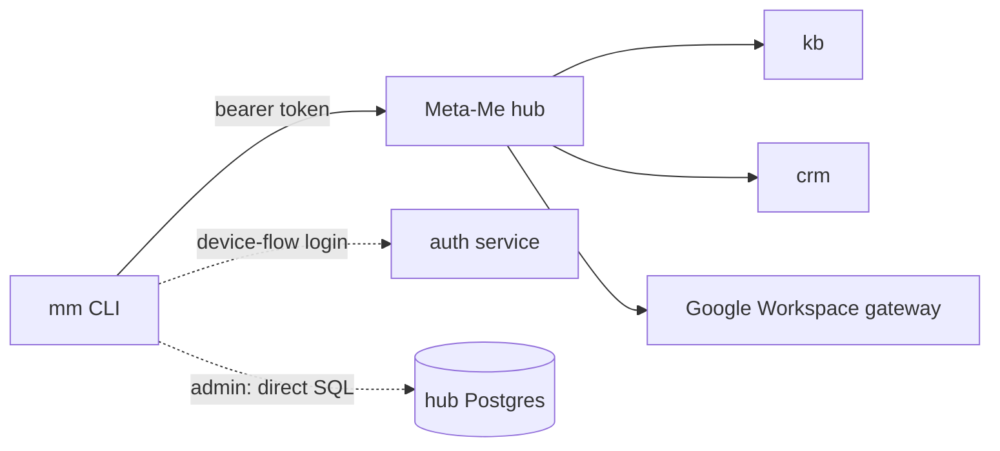

# mm

A single-binary Go CLI for the Meta-Me platform. One `mm login`, one bearer token,
every app on the platform reachable from one prompt — knowledge base, CRM, Google
Workspace, voice, the local agent, and platform admin.

```
mm [app] [command] [args...]
```

```console
$ mm cards
APP        DESCRIPTION
kb         Knowledge base — semantic search, collections, deep read
crm        Contacts, interaction log, daily priority surface
calendar   Google Calendar over the hub gateway
tasks      Google Tasks
drive      Google Drive (Markdown → native Doc)

$ mm calendar new --title "Review" --when "tomorrow 14:00"
✓ created — Review, Thu 31 Jul 14:00–15:00
```

## Why

This is one person's personal software platform, made public so the work is legible.
Meta-Me is a set of small apps that all speak the same wire contract; `mm` is the
one client that talks to all of them. Instead of a bespoke CLI per app, every app
publishes an Agent Card describing its capabilities, and `mm` dispatches against that
contract. Add an app to the platform and its commands appear in `mm` with no CLI
change.

## Quickstart

Requires Go 1.26+.
```bash
git clone https://github.com/joejarlett/mm-cli
cd mm-cli
go build -o ~/.local/bin/mm ./cmd/mm    # ensure ~/.local/bin is on your PATH
mm login                                # device-flow OAuth via auth.meta-me.uk
```

`mm login` opens your browser, polls for approval, and saves the token to
`~/.config/mm/auth.json` (mode 0600). Agent Card and manifest caches live under
`~/.mm-cli/` (24-hour TTL). Optional config is read from `~/.mm/.env`; explicit
environment variables always win. The hub, auth, and local-agent URLs default to the
live Meta-Me services and can be overridden with `MM_HUB_URL`, `MM_AUTH_URL`, and
`MM_LOCAL_AGENT_URL`.

> Without a Meta-Me account and a reachable hub, `mm login` has nothing to
> authenticate against — the CLI is the client half of a platform, not standalone.

### Self-update

```bash
mm update --check                       # is there a newer build?
mm update                               # download + verify + atomic overwrite
mm update --version v0.1.0              # pin a specific version
```

Resolves the latest version from the hub, downloads the platform binary
(`mm-{darwin,linux}-{arm64,amd64}`), verifies it against `SHA256SUMS`, and swaps it
in atomically.

## What you can do

```bash
# Discovery
mm cards                          # capability matrix across all apps
mm cards kb                       # full Card for one app
mm manifest kb                    # wire-level surface (every feature.action)

# Universal verbs — work on any app that publishes the contract
mm [app] ask "..."                # agent.chat — natural-language question
mm [app] find "..."               # agent.search — entity lookup
mm [app] do <tool> [k=v…]         # invoke a Card-declared tool by name
mm [app] <feature> <action> [k=v…] # raw dispatch to <app>/api/v2

# Knowledge base
mm kb find <q>                    # semantic search
mm kb tree                        # list collections
mm kb read <id>                   # full doc body

# CRM
mm crm surface                    # today's priorities
mm crm find <q>                   # search contacts
mm crm log "<text>"               # log an interaction

# Google Workspace (via the hub gateway)
mm calendar                       # agenda for 7 days
mm calendar new --title "..." --when "tomorrow 14:00"
mm tasks add "..." --due "next friday"
mm drive doc <name> --file path.md

# Local agent + voice
mm chat                           # list recent threads
mm chat send "hello @fedora"      # send with @node mention
mm stt <file>                     # transcribe audio
mm tts "<text>" --play            # synthesise speech

# Admin (requires MM_DATABASE_URL)
mm sql "<query>"                  # raw SQL on the hub Postgres
mm apps                           # list registered apps
mm health                         # hub health checks

mm status                         # auth + which apps the bearer sees
mm --json <any command>           # parseable output
```

## Architecture

`mm` is a thin dispatcher over a uniform contract. Every app exposes the same shape —
`GET /.well-known/agent.json` (its Agent Card), `GET /api/v2/manifest`, and
`POST /api/v2 {feature, action, payload}`. `mm` fetches the Card and manifest, caches
and validates locally, then dispatches with the bearer token.



Most commands go through the hub. Admin verbs (`mm sql`, `mm apps`, `mm health`) talk
directly to Postgres via `MM_DATABASE_URL` — a deliberate local-trust boundary that
bypasses the API hop.

Source map:

- `cmd/mm/main.go` — entry point + `@mention` argument preprocessing
- `internal/cmd/` — one file per subcommand
- `internal/http/` — REST and WebSocket clients
- `internal/wire/` — hub and Agent payload structures
- `internal/config/`, `internal/auth/`, `internal/card/` — config, token, Card cache

## Status & support

Personal project, shared as-is. No support, no roadmap commitments, and breaking
changes without notice. Issues and PRs may not be answered. It is built for one
person's platform, so much of it assumes services that only that platform runs.

## Licence

Not yet finalised. Until a `LICENSE` file is added, standard copyright applies (all
rights reserved) — you may read the source, but no rights are granted to use, copy, or
redistribute it.
